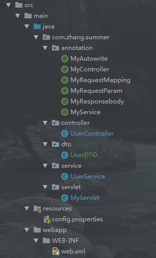

## Summer项目

### 介绍

- Summer项目是本人在学习Spring源码的时候按照SpringMVC的流程编写的一个简易的SpringMVC框架，主要完成以下功能：
    - 读取配置文件进行包的扫描
    - 对所有加入注解的bean进行装配
    - 对加了注解的字段进行依赖自动注入
    - URL与相应方法的映射
    - 请求的分发处理

项目通过实现以上流程完成SpringMVC框架工作的整体过程演示
    
### 以下是框架流程的详细步骤说明
#### 项目的结构
Summer项目仅仅是一个单独的Servlet项目，没有引入Spring相关的任何依赖，仅仅使用了一些外部的工具类，我的pom.xml文件如下：
```aidl
  <dependencies>
    <dependency>
      <groupId>javax.servlet</groupId>
      <artifactId>javax.servlet-api</artifactId>
      <version>3.1.0</version>
    </dependency>
    <dependency>
      <groupId>cn.hutool</groupId>
      <artifactId>hutool-all</artifactId>
      <version>4.5.10</version>
    </dependency>
    <dependency>
      <groupId>org.eclipse.jetty</groupId>
      <artifactId>jetty-maven-plugin</artifactId>
      <version>9.3.12.v20160915</version>
    </dependency>
    <dependency>
      <groupId>org.projectlombok</groupId>
      <artifactId>lombok</artifactId>
      <version>1.18.2</version>
    </dependency>
  </dependencies>
```
项目使用jetty启动，所以我还配置了jetty插件
```aidl
<build>
    <plugins>
      <!-- jetty插件 -->
      <plugin>
        <groupId>org.mortbay.jetty</groupId>
        <artifactId>maven-jetty-plugin</artifactId>
        <version>6.1.26</version>
        <configuration>
          <scanIntervalSeconds>0</scanIntervalSeconds>
          <contextPath>/Summer</contextPath>
          <connectors>
            <connector implementation="org.mortbay.jetty.nio.SelectChannelConnector">
              <port>4000</port>
            </connector>
          </connectors>
        </configuration>
      </plugin>
    </plugins>
  </build>
```
#### 整体框架结构


除了自定义的这几个注解之外其他的就和平常编写Controller以及Service的流程一样，我的核心代码主要在MyServlet中

#### MyServlet主要做了什么
##### 加载配置文件，首先读取web.xml中配置的配置文件
把扫描到的所有类全链路径名保存在list中
> 以下是servlet的配置

```aidl
<servlet>
    <!-- 声明Servlet对象 -->
    <servlet-name>myServlet</servlet-name>
    <!-- 上面一句指定Servlet对象的名称 -->
    <servlet-class>com.zhang.summer.servlet.MyServlet</servlet-class>
    <!-- 上面一句指定Servlet对象的完整位置，包含包名和类名 -->
    <init-param>
        <param-name>contextConfigLocation</param-name>
        <param-value>classpath:config.properties</param-value>
    </init-param>
    <!-- 下面一句是在启动时加载servlet -->
    <load-on-startup>0</load-on-startup>
</servlet>
<servlet-mapping>
    <!-- 映射Servlet -->
    <servlet-name>myServlet</servlet-name>
    <!--<servlet-name>与上面<Servlet>标签的<servlet-name>元素相对应，不可以随便起名  -->
    <url-pattern>/</url-pattern>
    <!-- 上面一句话用于映射访问URL -->
</servlet-mapping>
```
##### 遍历所有类，使用反射创建对象`class.forName`
创建对象，将所有我们声明了自己注解的类加入到一个Map中，即IOC-Map

##### 遍历IOC-Map中的所有对象，进行依赖注入
在这里我只判断是`@MyController`注解的类才进行依赖注入

##### 处理URL和方法之间的映射
将注解了`@MyRequestMapping`的类和方法路径拼接起来，对方法和拼接起来的url路径进行映射，并且对方法参数做特殊处理

##### 请求分发
在doGet或者doPost请求中通过映射好的url-method找到方法进行请求的分发处理